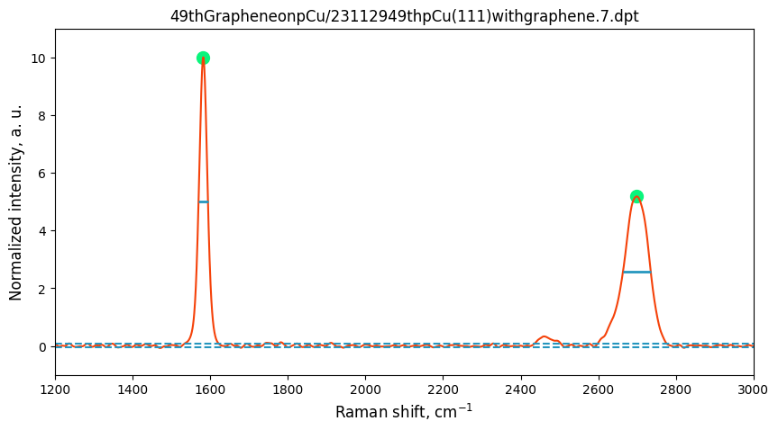
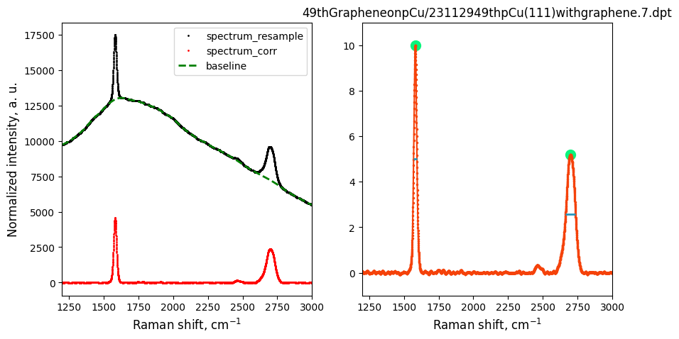

# Automated raman-analyzer 

<div align="center">

</div>

The long-term goal of this script is to automate peak-fitting process of Raman Spectrum.\
The typical procedure to process raman spectrum would include:
- Import the data
- Smooth the line
- Baseline reduction
- Peak and Shoulder Peak finder
- Peak Fitting 

## Dependencies
The script is based on `numpy`,`scipy`,`rampy`,`matplotlib`,`lmfit` to do 
data analysis and visualization.
```bash
pip install rampy
pip install lmfit

# put the following code in your .bashrc
export PYTHONPATH=$PYTHONPATH:/path/to/raman-analyzer
```


## Usage
### Operations on single Raman Spectrum
After running the codes, call: 
```Python
import analyzer as raman
raman = raman.raman_analyzer(name,min,max,filter,noise_min,noise_max)
```
- `name`: your Raman datafile name with full directory (string)
- `min`,`max` : the range of wavenumbers you are interested in analyzing
- `filter`: the filtration threshold for Raman peaks points (the more the filter number is , the less peak points would be stored).
- `noise_min`,`noise_max`: the range of wavenumbers you are interested in analyzing the noise level

- `raman` would be the object in which all the information is stored.

### Batch operation of exporting baseline corrected Raman spectra
```Python
directory = "raman_spectra_folder"
min = 1000
max = 3600
filter = 8
noise_min = 2000
noise_max = 2200
peaks,signals,fwhm,fwhm_test,name,peak_threshold = raman.raman_batch(directory,min,max,filter,noise_test=True,show=True,noise_min,noise_max)
```
- `noise_test`: if True, the script would plot the noise level of each spectrum



- `show`: if True, the script would plot the baseline corrected Raman spectra 
  


Outputs:

- `peaks`: the peak positions of each spectrum
- `signals`: the intensities of peaks of each spectrum
- `fwhm`: the full width at half maximum of each peak
- `name`: the name of each spectrum
- `peak_threshold`: the threshold of peak detection of each spectrum


### Calculation of peak ratios in batch

Peak rations of Raman spectra is a useful tool to analyze graphene and other 2D materials.

```Python
# "total" item is necessary for the calculation of peak ratios.
peak_param = {"d": [1340,1360,'auto'],
              "g": [1500,1750,9],
              "2d":[2500,2900,9],
              "total":[1000,3600,0.1,2000,2200]}
directory = "./raman_spectra"
peak_data, all_peaks = raman.ratio_calculator(directory,**peak_param)
```
- `peak_param`: the dictionary of peak parameters.
  - `"total"`: it contains the range of the whole spectrum, the filter number, and the range of noise level.
  - All other items: it contains the range of the peak, and the filter number. if the third value in the list is `"auto"`, the script would find the peak using maximum value in the range.

## To-do list
- [x] Batch operation of exporting baseline corrected Raman spectra
- [ ] Batch operation of exporting peak fitting results
- [ ] CLI usage of the script  
## Author
- Wentong Zhou[@Linkedin](https://www.linkedin.com/in/wentong-zhou-5ab2402a/)
  

## Citation

If you use this code, please cite the following paper:

```
